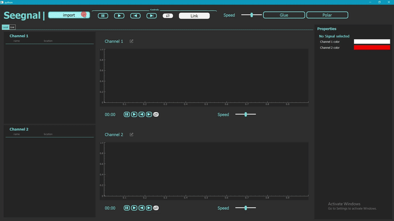
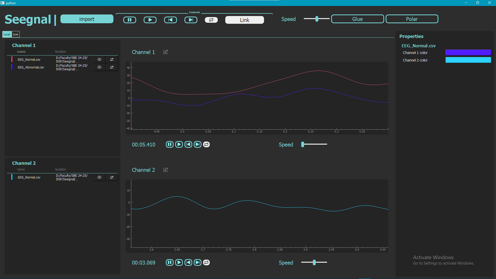
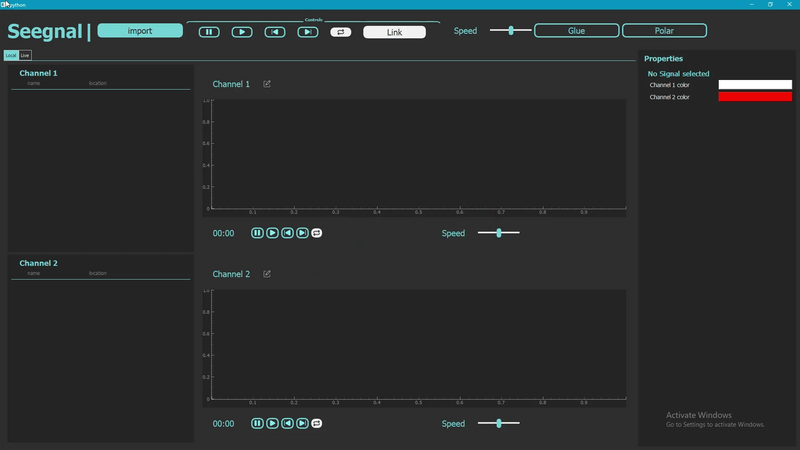
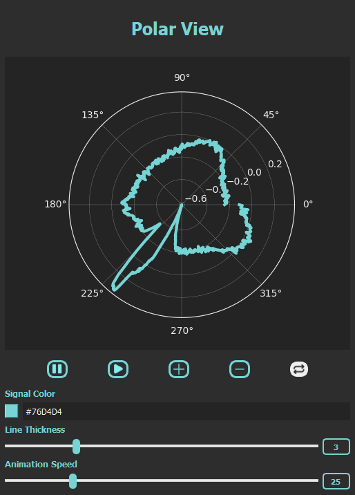
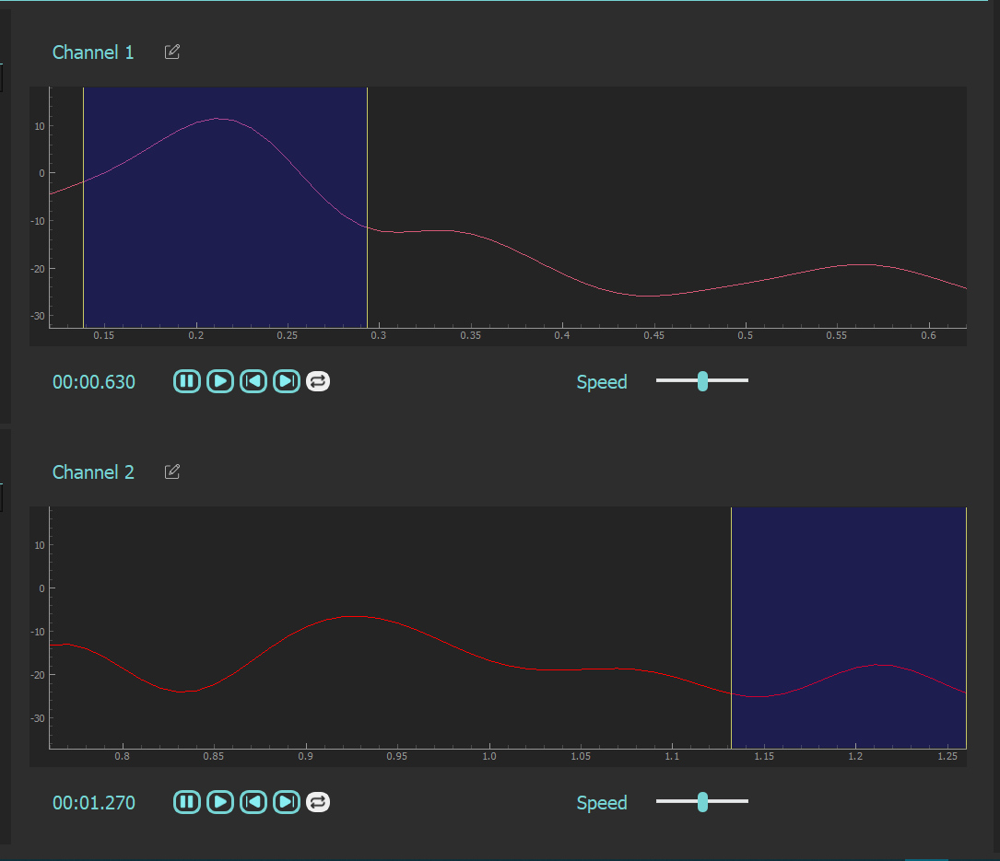
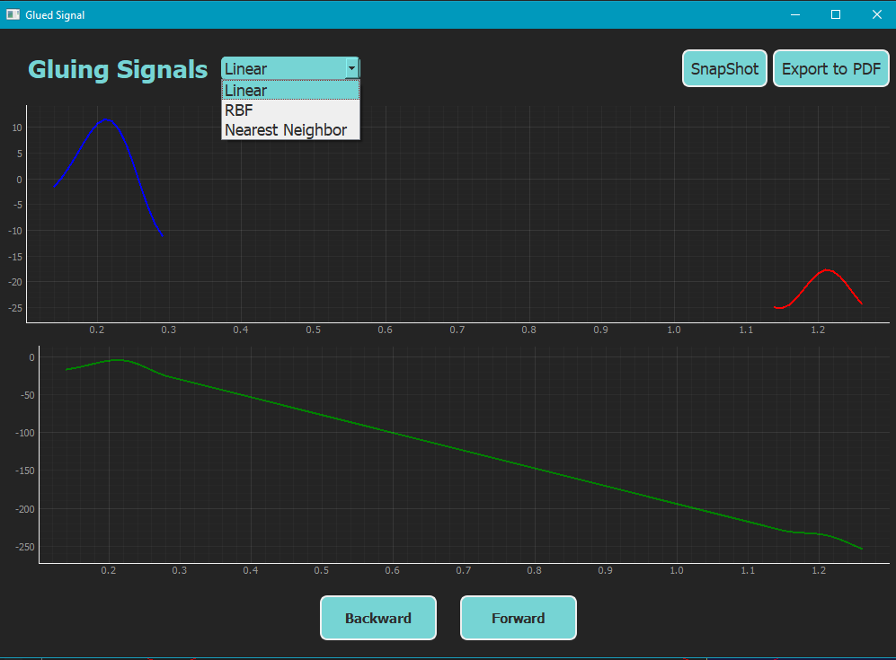
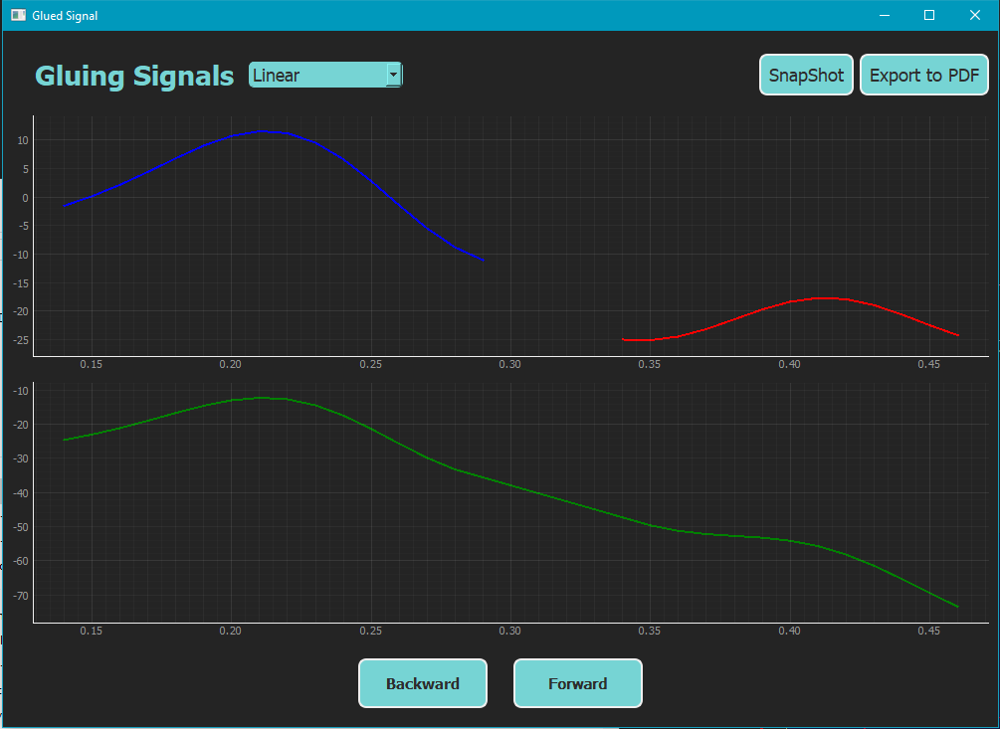

<h1 align="center">
    
</h1>

<h1 align="center">Seegnal</h1>
<h3 align="center">Multi-Port, Multi-Channel Signal Viewer</h3>

<h4 align="center"> 
	 Status: Finished
</h4>

<p align="center">
 <a href="#about">About</a> •
 <a href="#features">Features</a> •
 <a href="#how-it-works">How it works</a> • 
 <a href="#tech-stack">Tech Stack</a> •  
 <a href="#developers">Developers</a>
</p>

# About

**Seegnal** is a desktop application developed using Python and PyQt5 to visualize multi-port, multi-channel signals. This tool is ideal for users needing to monitor and analyze medical signals like ECG, EEG, and EMG with various control features including zoom, pan, and more.

---

## Features

- **Multiple Signal Sources**: Open different medical signal files or connect to real-time signal sources.

  
  
- **Plotting Live Signals**:
  
  
- **Interactive Graphs**: Two identical graphs to display signals, linked for synchronized zooming and panning.
- **Polar graph**: 


  
- **Cine Mode**: View signals in real-time similar to ICU monitors.
- **Signal Manipulation**: Change colors, add labels, zoom, and more.
- **Signal Glue**: Merge parts of signals with customizable parameters.

  
 <p align="center">
  
  
</p>

- **Exporting & Reporting**: Generate PDF reports with statistical analysis of the signals.

## Tech Stack

The following tools were used in the construction of the project:

- **[Python](https://www.python.org/)**
- **[PyQt5](https://riverbankcomputing.com/software/pyqt/intro)**
- **[PyQtGraph](https://www.pyqtgraph.org/)**
- **[NumPy](https://numpy.org/)**
- **[Matplotlib](https://matplotlib.org/)**
- **[Pandas](https://pandas.pydata.org/)**

---


## How it Works

The application is built with **Python** and **PyQt5**. It allows the user to open and visualize multiple signals on independent graphs, with full control over the display and interaction.

### Pre-requisites

Before running the application, make sure you have **Python** installed on your system. You will also need **pip** for installing dependencies.

---

## How to Run the Project Locally

To run the project locally, follow these steps:

### Steps:

1. **Clone the repository:**
   ```bash
   git clone https://github.com/your-username/Seegnal.git
   ```

2. **Navigate to the project folder:**
   ```bash
   cd Seegnal
   ```


3. **Install the required dependencies:**
   ```bash
   pyqt5
   pyqtgraph
   numpy
   matplotlib
   pandas
   ```

5. **Run the application:**
   ```bash
   python main.py
   ```

This will start the **Seegnal** application locally.

---

## Developers

| [**Talal Emara**](https://github.com/TalalEmara) | [**Meram Mahmoud**](https://github.com/Meram-Mahmoud) | [**Maya Mohammed**](https://github.com/Mayamohamed207) | [**Nouran Hani**](https://github.com/Nouran-Hani) |
|:------------------------------------------:|:------------------------------------------:|:------------------------------------------:|:------------------------------------------:|

---


## Learn More

To learn more about PyQt5 and PyQtGraph, check out their official documentation:

- [PyQt5 Documentation](https://riverbankcomputing.com/software/pyqt/intro)
- [PyQtGraph Documentation](https://www.pyqtgraph.org/)
